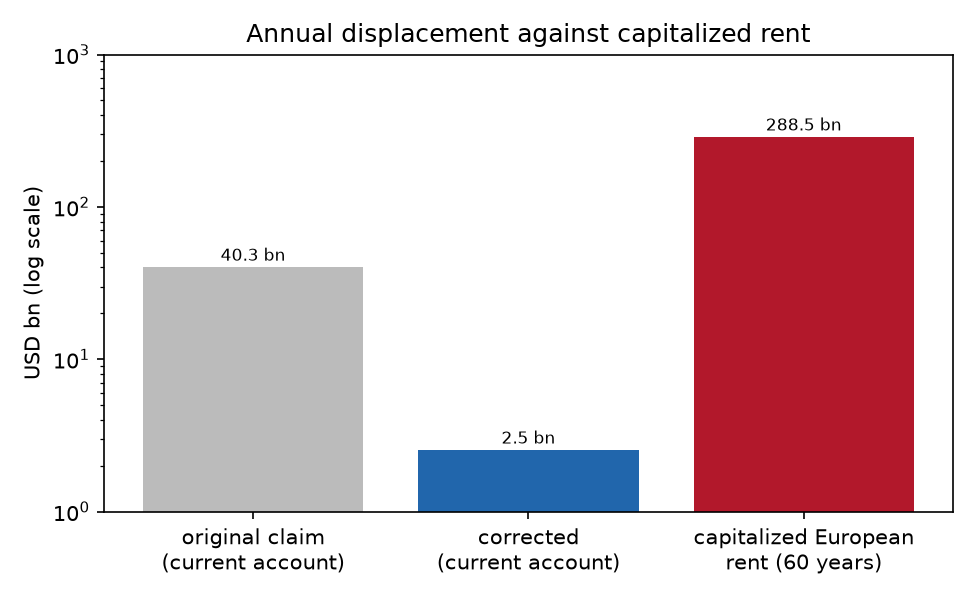

## Abstract

A hypothesis circulating in Bucharest holds that Romania's turn toward gas serves a United States strategy of keeping Europe on fossil fuels, and it prices the stake as a 1.7 to 3.6 percent deterioration of the US current-account deficit. The interest is real and the arithmetic wrong. We distinguish molecule power, control over a recurring fuel flow metered at chokepoints, from electron power, control over a capital stock and its standards. Because molecule revenue requires the customer to remain unelectrified, a fossil exporter has a structural interest in delay. We model an importing region's electric share with a replicator equation including technological learning; the system is bistable, and the exporter's price moves the takeoff threshold. Holding the price below a trap price of 7.88 dollars per thousand cubic feet keeps the importer below threshold. For a patient exporter facing fast substitution, extending the fossil age by limit pricing yields 1.9 times the present value of harvesting it at a high price, and the rent-maximizing price stays below the trap price only for discount rates below 0.171 and substitution speeds above 0.188. The displacement the hypothesis priced amounts to 0.13 to 0.23 percent of the deficit, an order of magnitude less than claimed, whereas the capitalized European rent that a takeoff would terminate is about 289 billion dollars, 113 times the annual figure. Because learning is global, a rival's continued deployment erodes any suppression, so limit pricing buys a finite delay. The Romanian outcome follows from each actor's independent optimum without coordination; pricing the incentive does not establish an instruction.

## 1. Introduction

A reading of Romanian politics circulating in Bucharest runs as follows. The country's growth model is in crisis, and its political class, from the presidency to the nationalist opposition, has turned to gas, understood narrowly as the molecule, as the way out. The turn suits a United States that has declared energy dominance a strategic objective and wants Europe anchored as a buyer of American liquefied natural gas for decades, since a Europe that electrified and built its own electricity economy would stop buying. On this reading the sidelining of a sovereign European electricity project is a transatlantic commercial interest presented as energy security, and Romania's leaders serve the American side, knowingly or not.

The hypothesis also attempts a quantification. It estimates that a European shift toward electricity would displace some American gas, values the displacement at 15 to 25 billion dollars a year, and reads the result as a 1.7 to 3.6 percent deterioration of the US current-account deficit, large enough to motivate a strategy. Each step overstates. The displaced volume is plausible, but the revenue attached to it is inflated by close to an order of magnitude, the deficit used as the denominator was nearer 1.12 trillion dollars than the 700 to 900 billion assumed, and the resulting share is about a tenth of the figure claimed.

The correction does not refute the underlying intuition. A large stake is at issue, and the original arithmetic fails because it prices the wrong object in the wrong account. Seeing this requires a distinction obscured by the word energy, between two forms of power that behave so differently that a strategy rational under one appears irrational when scored under the other. We draw the distinction, build a minimal dynamical model in which it has consequences, and use the model to relocate the stake. Whether Romanian actors take instructions from Washington is not shown by the public evidence and is not needed by the argument; the question is what kind of object the stake is, and why a fossil exporter would defend it at the cost of suppressing its own price.

## 2. Molecule power and electron power

The contrast between petrostates and electrostates has been drawn most sharply by Adam Tooze, who treats them as ideal types of how states convert energy into geopolitical power (Tooze, 2025). The distinction predates the terms. Hirschman showed in 1945 that the power one country holds over another through trade is the power to interrupt a flow on which the other depends, and that this leverage is greatest where the dependence is hardest to redirect (Hirschman, 1945). Molecule power is the clearest present-day case. Oil and gas are flows metered at wells, straits, pipelines and regasification terminals, and the exporter's leverage is the standing option to slow or stop the flow at a chokepoint the importer cannot quickly bypass. The rent recurs because the molecule is consumed and must be bought again. The geopolitics of the hydrocarbon age is organized around such chokepoints (Yergin, 2011; Goldthau and Sitter, 2015).

Electron power rests on a different object, which the literature on the geopolitics of renewables has begun to map (Scholten and Bosman, 2016; Scholten, 2018; Overland, Bazilian, Ilimbek Uulu, Vakulchuk and Westphal, 2019). Solar and wind electricity is not a flow an exporter controls, since sunlight reaching an installed panel cannot be embargoed. What is traded, and therefore carries power, is the capital stock and its standards: turbines, modules, batteries, inverters and grid equipment, together with the software and technical norms that connect them. The resulting dependence is a one-time capital purchase followed by a long tail of spares, replacements, financing and standards lock-in. An electrostate's leverage is a platform on which others build, and its rent is the margin on installed equipment and control of the next generation of standards.

The central asymmetry follows. A molecule exporter is paid only while its customer remains on molecules. Every kilowatt-hour an importer generates from its own installed stock replaces fuel it would have bought, so electrification retires a customer. The fossil exporter therefore has a structural interest in delay that an electron exporter lacks. The Bucharest hypothesis points at this interest, which is real, but prices it in the annual trade balance, where it does not reside.

Three qualifications apply, and the model respects them. The United States is not a petrostate in the fiscal sense; it holds molecule power and electron power at once, and the object of analysis is its fossil-export strategy (Tooze, 2025). An importer that electrifies on another power's equipment, as Europe would on Chinese modules and batteries, exchanges a fuel dependency for an industrial one, which is why the European Union's Net-Zero Industry Act seeks to bring manufacturing onshore as well as to deploy. Electricity is also not yet a large share of final energy anywhere: the International Energy Agency puts it near 0.28 in China, 0.22 in the United States and 0.21 in the European Union, so the transition is at an early stage, where a strategy of delay has the most to gain (International Energy Agency, 2025).

## 3. Model

Let $x(t) \in [0, 1]$ be the share of an importing region's useful energy services supplied electrically, so that $1 - x$ is the molecular system. Substitution between the two is a competition between systems, and the minimal description is a replicator equation (Hofbauer and Sigmund, 1998):

$$\dot{x} = \eta\, x (1 - x)\, \Delta(x),$$

where $\eta$ is the speed of capital replacement and adoption and $\Delta$ is the net advantage of the electric system in cost, security and political support. The advantage depends on $x$ because deployment changes it. Cumulative installation drives equipment costs down a learning curve, on which each doubling of installed capacity lowers unit cost by a roughly constant fraction, a regularity that holds more reliably for clean-energy technologies than for fossil extraction (Nagy, Farmer, Bui and Trancik, 2013; Way, Ives, Mealy and Farmer, 2022). Integration costs act in the opposite direction, since grids and storage become harder to balance as the variable share rises. A local linearization of both gives $\Delta(x) = A + (\ell - \kappa) x$, with learning slope $\ell$ and integration slope $\kappa$, so that

$$\dot{x} = \eta\, x (1 - x)\,\big[A + (\ell - \kappa) x\big].$$

The cubic has equilibria at $x = 0$, $x = 1$ and an interior point $x^{\dagger} = -A / (\ell - \kappa)$. When $A < 0 < A + (\ell - \kappa)$, both boundary equilibria are stable and $x^{\dagger}$ is the unstable threshold between them. The system is bistable, which is carbon lock-in expressed as dynamics: below $x^{\dagger}$ the economy returns to the fossil equilibrium, above it learning and coalition feedback carry it to full electrification, and a subsidy that pushes it across need not be maintained afterwards (Unruh, 2000; Arthur, 1989; David, 1985). Lock-in, in this description, is a basin of attraction. The directed-technical-change feedback that creates the threshold also makes it persistent, since policy that redirects innovation toward the clean sector changes relative costs endogenously (Acemoglu, Aghion, Bursztyn and Hemous, 2012).

The exporter's price enters $A$: a higher fossil price raises the advantage of electrifying, $A(p_P) = A_{\text{base}} + \alpha (p_P - p_{\text{ref}})$. The calibration uses $\ell - \kappa = 0.8$, $A_{\text{base}} = -0.3$ at a reference price of 7 dollars per thousand cubic feet, $\alpha = 0.15$, an exporter marginal cost including liquefaction and shipping of 3 dollars, a current European volume of 86 billion cubic metres, an importer electric share $x_0 = 0.21$ and a horizon of 60 years. The exporter earns a margin $(p_P - c_P)$ on a volume proportional to $1 - x$. The magnitudes are illustrative and anchored to public 2025 figures.

## 4. Results

### 4.1 The price as a lever on the takeoff threshold

The exporter's pricing decision determines where the importer's threshold lies. In the calibration the advantage becomes positive, and takeoff automatic, above a price of 9.00 dollars per thousand cubic feet; the importer's current share lies on the threshold at 7.88 dollars, the trap price; and below 3.67 dollars the electric equilibrium becomes unreachable (Figure 1). Between the lockout and trap prices lies a window in which the exporter, by holding its price down, keeps the importer's threshold above its current share and the importer on the molecular side.

{width=85%}

### 4.2 Harvesting and extending the fossil age

The lever has a cost. The exporter earns a margin on the volume it still sells, and the volume is proportional to $1 - x$. Raising the price increases the margin but, by lifting the importer over its threshold, starts $x$ rising toward one and the volume falling toward zero. Lowering the price into the trap window preserves the volume at a thinner margin. The exporter therefore chooses between two paths: harvesting the fossil age at a high price or extending it by limit pricing.

The two are compared by integrating the discounted rent stream along the transition each price induces. A harvest price of 9.5 dollars yields a large margin while the importer electrifies, reaching 90 percent electric after about 12 years at a substitution speed of 0.6. An extend price of 5.5 dollars yields a smaller margin on a volume that persists because the importer never crosses. At a discount rate of 0.03 and that substitution speed, the present value of extending is 259 billion dollars against 135 billion for harvesting, a ratio of 1.9.

The ratio depends on patience and on the speed of substitution. At the default parameters ($\eta = 0.4$, $r = 0.05$) the rent-maximizing constant price is 7.71 dollars, just below the trap price (Figure 2, left). As the discount rate rises, the rent-maximizing price moves upward continuously and crosses the trap price at $r = 0.171$ for a substitution speed of 0.6; a sufficiently impatient exporter harvests, because the future volume it would protect is discounted away. At a discount rate of 0.03, the optimum lies below the trap price only for substitution speeds above 0.188; against a slow transition there is little to defend, and the exporter takes the high margin. Both crossovers were located by bisection on the refined optimum; the grid scans place them at 0.165 and 0.20. Limit pricing is therefore rational when a patient incumbent faces a fast transition. An exporter that holds its price down and forgoes current rents reveals an expectation that the unobstructed transition would be fast, because only that expectation makes the sacrifice pay. A strategy of energy dominance through cheap, abundant exports is, on this account, evidence that its authors expect the electric transition to be near.

{width=100%}

### 4.3 Current-account displacement and capitalized rent

The hypothesis proposed a displacement of 5 to 9 billion cubic metres of American gas from Europe by a marginal electrification step. At a price of 8 dollars per thousand cubic feet this is 1.4 to 2.5 billion dollars of lost sales, or 0.13 to 0.23 percent of a 1.12 trillion dollar current-account deficit. The original estimate of 1.7 to 3.6 percent was an order of magnitude too large.

The stake itself is larger, and it sits in a different account. The current-account figure prices one year of one marginal displacement. An exporter keeping an importer below its threshold defends the entire European rent stream that crossing the threshold would terminate. The annual rent on the exporter's current European volume is about 15 billion dollars; capitalized over the 60-year working life of the molecular capital, its present value is about 289 billion dollars, close to the 304 billion of an undated perpetuity and 113 times the annual current-account figure (Figure 3). The exact value depends on the assumed margin, discount rate and horizon, none of which is measured here, but no defensible setting brings a capitalized rent stream within an order of magnitude of one year's receipts. The original argument therefore understated the stake: it priced a perpetuity as a single year's payment and recorded that payment in the trade balance. Molecule power is a claim on a recurring flow, and the value of a recurring flow is a capital sum.

{width=80%}

### 4.4 Bounded delay under global learning

A further asymmetry limits what limit pricing can achieve. The learning curve that lowers the cost of electric equipment is driven by cumulative deployment, which is global. An exporter that suppresses one region's deployment by holding its advantage term down does not affect the modules and batteries a rival electrostate continues to install elsewhere. Those installations lower the global cost, so the advantage term rises over time wherever the importer sits, independently of the exporter's price.

Limit pricing therefore buys a finite delay whose length is set by the rival's deployment rate. If a constant limit price holds the importer's advantage 0.12 below its takeoff value, global learning closes that distance after a delay inversely proportional to the rival's deployment rate: about 24 years at the slowest rate considered, 6 years at four times that rate and 3 years at eight times. The delay is finite for every positive rate, and the exporter cannot drive the rival's rate to zero, because the rival deploys for its own reasons in its own market. Energy dominance pursued through price suppression is thus a delaying action against a threshold that another party is lowering, best read as a wager on how many years of molecular rent remain.

## 5. The Romanian case

Romania motivated the question, and the model places it near its own threshold, where the next decade of capital allocation can tip it either way. Its choices are strengthening the molecular side. The Neptun Deep development is expected to produce about 8 billion cubic metres a year from 2027, roughly doubling national output, and the associated gas-fired generation and pipeline commitments increase the political weight of the fossil coalition and lower the advantage term $A$. In the model, this raises Romania's own takeoff threshold above its current position and moves it toward the fossil equilibrium, the lock-in the Bucharest hypothesis describes.

The hypothesis errs in moving from outcome to agent. The lock-in and its complementarity with American interests are real, but the model produces both without coordination. Several actors pursue their own objectives: a domestic rent coalition of producers, ministries and contractors that captures gas revenue directly; a security doctrine that treats domestic gas as insurance against Russian supply and as regional leverage; a growth-model crisis that favours fast, fiscally legible exports; and an American export strategy with its own reasons to keep Europe on gas. These objectives point in the same direction without anyone aligning them, and the joint outcome, a Romania that deepens its molecular commitment while Europe's electricity project waits, is overdetermined. When four independent mechanisms produce an outcome, a fifth mechanism, a coordinating instruction from Washington, is not required to explain it.

The case contains a further complication. Romanian Black Sea gas competes with American liquefied natural gas. The 8 billion cubic metres of Neptun Deep lie within the 5 to 9 billion the hypothesis imagined Europe displacing, and gas sold by Romgaz or its partners is gas not bought from a Gulf Coast terminal. Romania and the United States are aligned on the energy regime, since both benefit from Europe remaining on gas, and are commercial rivals as suppliers. The relationship is structural complementarity combined with commercial rivalry, and the distinction determines what evidence would settle the question. The public record establishes that Romanian and American positions point the same way. It does not establish a temporal sequence in which one preceded and produced the other, nor does it document an instruction. The model prices the incentive and keeps that question separate.

## 6. Limitations

The model is minimal. The advantage function is a local linearization, the exporter chooses a single constant price, the importer does not respond strategically, and learning enters the bounded-delay calculation as an exogenous drift of the advantage term. The calibration is illustrative, and the crossovers at a discount rate of 0.171 and a substitution speed of 0.188 depend on it. The capitalized stake is sensitive to the assumed margin and horizon, although its order of magnitude is not. The model says nothing about the intentions of any Romanian or American actor.

## 7. Conclusion

The Bucharest hypothesis identifies a real interest and misprices it. Separating molecule power from electron power places the exporter's stake in the capitalized value of a recurring rent stream, about two orders of magnitude above the annual trade-balance figure, and shows why limit pricing is rational for a patient exporter facing fast substitution. Global learning bounds the delay such a strategy can buy, and the Romanian outcome follows from independent optima without requiring coordination.

## Reproducibility

The model is in `simulation/` (`analyses.py`, `figures.py`, `run_all.py`) and runs with `uv run python run_all.py`; the dynamics are integrated deterministically by fourth-order Runge-Kutta with a step of 0.02 years, and every modelled number is written to `simulation/output/results.json`, with figures in `simulation/output/figures/`. The run checks that the refined rent-maximizing price lies on opposite sides of the trap price on either side of each reported crossover, and that the harvest price leads to takeoff while the extend price does not.

## References

Acemoglu, D., Aghion, P., Bursztyn, L., and Hemous, D. (2012). The environment and directed technical change. *American Economic Review*, 102(1), 131–166.

Arthur, W. B. (1989). Competing technologies, increasing returns, and lock-in by historical events. *Economic Journal*, 99(394), 116–131.

David, P. A. (1985). Clio and the economics of QWERTY. *American Economic Review*, 75(2), 332–337.

Goldthau, A., and Sitter, N. (2015). *A Liberal Actor in a Realist World: The European Union Regulatory State and the Global Political Economy of Energy*. Oxford University Press.

Hirschman, A. O. (1945). *National Power and the Structure of Foreign Trade*. University of California Press.

Hofbauer, J., and Sigmund, K. (1998). *Evolutionary Games and Population Dynamics*. Cambridge University Press.

International Energy Agency. (2025). *Electricity 2025*. IEA.

Nagy, B., Farmer, J. D., Bui, Q. M., and Trancik, J. E. (2013). Statistical basis for predicting technological progress. *PLoS ONE*, 8(2), e52669.

Overland, I., Bazilian, M., Ilimbek Uulu, T., Vakulchuk, R., and Westphal, K. (2019). The GeGaLo index: Geopolitical gains and losses after energy transition. *Energy Strategy Reviews*, 26, 100406.

Scholten, D. (Ed.). (2018). *The Geopolitics of Renewables*. Springer.

Scholten, D., and Bosman, R. (2016). The geopolitics of renewables: Exploring the political implications of renewable energy systems. *Technological Forecasting and Social Change*, 103, 273–283.

Tooze, A. (2025). Chartbook 439: Electrostates versus petrostates. *Chartbook*.

Unruh, G. C. (2000). Understanding carbon lock-in. *Energy Policy*, 28(12), 817–830.

Way, R., Ives, M. C., Mealy, P., and Farmer, J. D. (2022). Empirically grounded technology forecasts and the energy transition. *Joule*, 6(9), 2057–2082.

Yergin, D. (2011). *The Quest: Energy, Security, and the Remaking of the Modern World*. Penguin Press.
